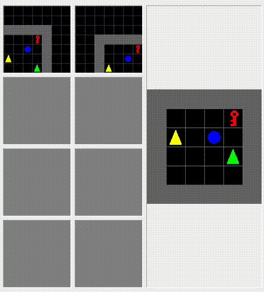

# Learning LTL Task Specifications for Multiagent Systems under Multiple Objectives

<div id="top"></div>

<!-- PROJECT SHIELDS -->
<!--[![Contributors][contributors-shield]][contributors-url]
[![Forks][forks-shield]][forks-url]
[![Stargazers][stars-shield]][stars-url]
[![Issues][issues-shield]][issues-url]
[![Apache-2.0 License][license-shield]][license-url]
[![LinkedIn][linkedin-shield]][linkedin-url]
-->

[![Issues][issues-shield]][issues-url]
[![Apache-2.0 License][license-shield]][license-url]


<!-- PROJECT LOGO -->
<br />
<div align="center">
<h3 align="center">LTL2TeamBot</h3>

  <p align="center">
    Framework to support LTL task allocation to a team of cooperative robots acting under multiple objectives.
    <br />
    <a href="https://github.com/tmrob2/ltl2teambot"><strong>Explore the docs »</strong></a>
    <br />
    <br />
    ·
    <a href="https://github.com/tmrob2/ltl2teambot/issues">Report Bug</a>
    ·
    <a href="https://github.com/tmrob2/ltl2teambot/issues">Request Feature</a>
  </p>
</div>


<!-- TABLE OF CONTENTS -->
<summary>Table of Contents</summary>
<ol>
<li>
  <a href="#about-the-project">About The Project</a>
</li>
<li>
  <a href="#installation">Installation</a>
</li>
<li>
  <a href="#environment">Usage</a>
</li>
<li><a href="#specifying-tasks">Specifying Tasks</a></li>
<li><a href="#learning-policies-for-agents">Learning Policies for Agents</a></li>
<li><a href="#training">Training</a></li>
<li><a href="#visualisation">Visualisation</a></li>
<li><a href="#data-and-results">Data and Results</a></li>
<li><a href="#contact">Contact</a></li>
<li><a href="#acknowledgments">Acknowledgments</a></li>
</ol>


<!-- ABOUT THE PROJECT -->
## About The Project

This framework supports multiagent reinforcment learning in enormous or unknown environments.
The key idea of this framework is using a shared parameter network for the learning phase
and then each agent executes its own policy. This is the so-called Centralised Training Decentralised Execution (CTDE) paradigm. 
This framework implements deterministic task allocation to cooperative robot teams, and parameterises the task allocation space for agents, updating the allocation parameters using a policy gradient approach. Parameterising the task allocation space is a unique way of scalarising the the multi-objective problem specifically in terms of task allocation.

<!-- INSTALLATION -->
## Installation

1. Create a new anaconda environment. 
1. There is an ```environment.yml``` file in the root directory which can be installed with:
    ```bash
    conda env create -n myenv -f environment.yml
    ```
1. Clone the environment.
1. To do development run 
    ```bash
    pip install . -e
    ```
1. Troubleshooting step: if there are issues with Pytorch go to [Pytorch Website](https://pytorch.org/) and get the correct drivers to configure your GPU.

<!-- ENVIRONMENT -->
## Environment

The example implemented in this research is a multiagent environment where agents interact together to learn how to complete a set of tasks. The environment
is an augmented version of the [teamgrid](https://github.com/mila-iqia/teamgrid) environment
In this setting there
are a number of challenges to overcome, including, how the agents learn
to resolve conflicts such as moving to same square, or avoiding picking up 
the same object.

Environments are customised in the `mappo/envs` directory. For example a simple test environment with two agents and two tasks can be found in `mappo/envs/so_small_ltl_env.py`. The environments included are:
1. `so_small_ltl_env.py` a 2 agent 2 task small grid environment. 
2. `task${x}_agent2_simple.py` 2 agents must complete $x$-number of tasks, i.e. interacting with different objects to complete a mission. 

<!-- SPECIFYING TASKS -->
## Specifying Tasks

In this framework tasks are specified using LTL trees. An example of an LTL parse tree for the formula $\psi ::=\neg x \ \mathtt{U} \ ( \ Y \ \lor \ Z \ )$ is given below:

             U
           /    \
        not      and
         |       /   \
         r      j    U
              /     \
            not      k
             |
             p


There are a number of representations, however, this framework uses *prefix notation*, e.g. for the LTL parse tree above $(\mathtt{U}, (\neg, r),(\land, j, (\mathtt{U}, (\neg, p), k)))$. This can be efficiently learned as strings by a Gated Recurrent Unit (GRU) or the parse trees themselves can be encoded and learned using Graph Attention Networks (GAT).

The prefix notations are injected directly into the environment in the ```mappo/envs``` directory.

<!-- LEARNING POLICIES FOR AGENTS -->
## Learning Policies for Agents

The main network used in for experiments in this framework is the ```AC_MA_MO_LTL_Model``` which can be imported from ```mappo/networks```

```Python
from mappo.networks.mo_ma_ltlnet import AC_MA_MO_LTL_Model
```

The task learning network is an Actor-Critic network where the critic network outputs a tensor with shape ```(...,num_objectives)```.

The network architecture to learn teamgrid policies which address LTL task specifications is shown below. Notice that, different from independent agent architectures, a single shared network is used for all agents. An agent does not 'see' the observations of other agents but the network is trained on the observations of all agents. In this way the CTDE requirement is met. 

```yaml
Input: img, task, ltl
   |
   v
Image Convolution (64 filters)
   |
   v
Memory LSTM (if use_memory=True)         LSTM LTL Embedding
   |                                         |
   |                                         v
   |                                         LTL GRU
   |                                         |
   |                                         v
   -------------------------------------------
   v
Embedding: embedding
   |
   v

Composed Features: composed_x
   |
   v
Actor Network: logits for actions
   |
   v
Critic Network: Multi-objective value estimation
```

The algorithm for training utilises a novel multiagent multi-objective Proximal Policy Optimisation algorithm which uses mini-batch. In the multiagent version of PPO the idea is to share the parameters of the policy so that each agent directly learns from the trajectories of all other agents.  

<!-- TRAINING -->
## Training

Training the model occurs in ```mappo/eval/team_grid``` directory, for example, ```mappo/eval/team_grid/experiments.py```. 

The following steps are followed:
1. Register the environment and initialise data recorder.
2. Initialised input parameters. 
3. Construct an observation environment for each agent. 
4. Specify the device and call the model constructor. 
5. There are two sets of parameters to update: $\kappa$-task allocation, and $\theta$-policy.
5. Initialise the PPO algorithm and parameters.
6. While the frames is less than the number of total frames and the best score for each objective is less than some threshold, collect experiences for each agent and update $\kappa, \theta$.
    - The loss function is based on both parameters:

    

    where the first term manages the cost of each agent $i$ performing tasks while the second term manages the probability of completion for each task $j$.
7. Print the outputs of the training and save models based on high-performing outputs.

<!-- VISUALISATION -->
## Visualisation

After training has completed the learned policies can be visualised using:
```bash
python mappo/eval/team_grid/dec_visualisation.py
```

An example of the simple training environment can be seen below. 



<!-- DATA AND RESULTS -->
## Data and Results

Results for experiments can be found in the data folder. 

<!-- LICENSE -->
## License

Distributed under the Apache-2.0 License. See `LICENSE` for more information.

<p align="right">(<a href="#top">back to top</a>)</p>


<!-- CONTACT -->
## Contact

Thomas Robinson - [@tmrobai](www.linkedin.com/in/tmrobai) - [Email](tmr463@uowmail.edu.au)

Project Link: [https://github.com/tmrob2/ltl2teambot](https://github.com/tmrob2/ltl2teambot)

<p align="right">(<a href="#top">back to top</a>)</p>


<!-- MARKDOWN LINKS & IMAGES -->
<!-- https://www.markdownguide.org/basic-syntax/#reference-style-links -->
[contributors-shield]: https://img.shields.io/github/contributors/tmrob2/ltl2teambot.svg?style=for-the-badge
[contributors-url]: https://github.com/tmrob2/ltl2teambot/graphs/contributors
[forks-shield]: https://img.shields.io/github/forks/tmrob2/ltl2teambot.svg?style=for-the-badge
[forks-url]: https://github.com/tmrob2/ltl2teambot/network/members
[stars-shield]: https://img.shields.io/github/stars/tmrob2/ltl2teambot.svg?style=for-the-badge
[stars-url]: https://github.com/tmrob2/ltl2teambot/stargazers
[issues-shield]: https://img.shields.io/github/issues/tmrob2/ltl2teambot.svg?style=for-the-badge
[issues-url]: https://github.com/tmrob2/ltl2teambot/issues
[license-shield]: https://img.shields.io/github/license/tmrob2/ltl2teambot.svg?style=for-the-badge
[license-url]: https://github.com/tmrob2/ltl2teambot/LICENSE
[linkedin-shield]: https://img.shields.io/badge/-LinkedIn-black.svg?style=for-the-badge&logo=linkedin&colorB=555
[linkedin-url]: https://linkedin.com/in/linkedin_username

